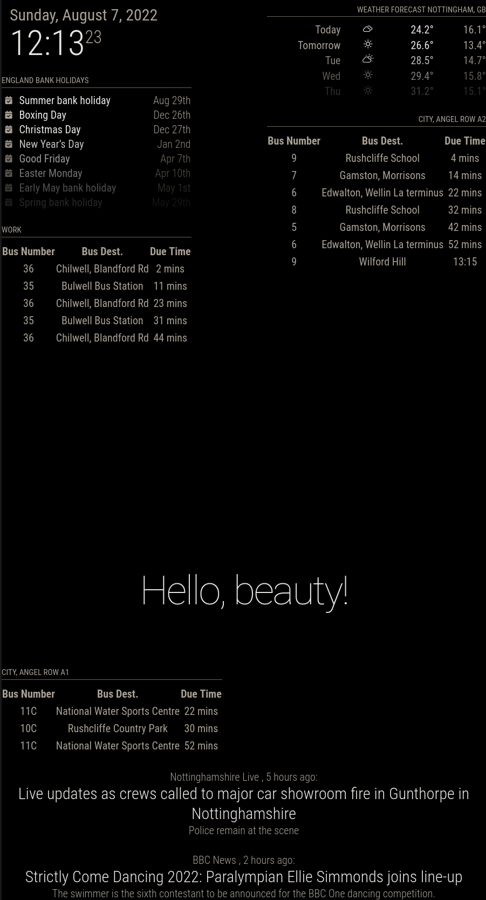

# MMM-NCTtimes
This is a Module for the [Magic Mirror Project](https://magicmirror.builders/) that displays bus times for bus stops that belong to [Nottingham City Transport](https://nctx.co.uk). The module gets the info by using the axios and cheerio nodejs libraries and scraping the NCT website, as they do not provide an API. This Module aims to look similar in format to the live displays used at the physical bus stops around Nottingham, whilst still remaining in style with the other default MagicMirror modules.

Please note at the moment it will take approx 30 secs for the data to load when first launching MagicMirror, I do however plan to fix this in the future.



## Credits

The main inspiration for this project comes from [jrmedd/nct-buses](https://github.com/jrmedd/nct-buses). Whilst this project does not borrow and code from there, without me finding that project (and jrmedd kindly open sourcing the project), this module wouldn't exist so a huge thanks to [jrmedd](https://github.com/jrmedd/)


## Installation

1. Go to the MagicMirror module directory

2. Clone this repository:
```bash
git clone https://github.com/dnmmrdr/MMM-NCTtimes.git
```
3. Install npm packages:
```bash
cd ./MMM-NCTtimes
npm install
```

## Configuration

You will need to [obtain a stop code from NCT](https://s3-eu-west-1.amazonaws.com/passenger-sources/nctx/txc/nctx_1654520711.zip). In this XML file all stops are listed with there 'stop code' this is needed so the module can find the appropriate stop to scrape.

The below is the bare minimum config required to get the module working:


    {
            module: "MMM-NCTtimes",
            position: "top_left",
            config: {
                    stop: "3390A2"
    }


Where stop is the stop code obtained from NCT.

### Config


Option|Value
------|-----------
`stop`|Stop code. (See above)<br>**Required**
`amount`|This is an integer of how many buses you would like to see, for example if it were set to 6 it would show the next 6 buses.</br>**Default: 5**
`refresh`| How often in seconds the module will refresh it's data, recommened to leave default. Please be aware that if you set this too often the NCT site will automatically block your IP for a small period of time due to the high number of requests going to the site to often. </br>**Default: 30**